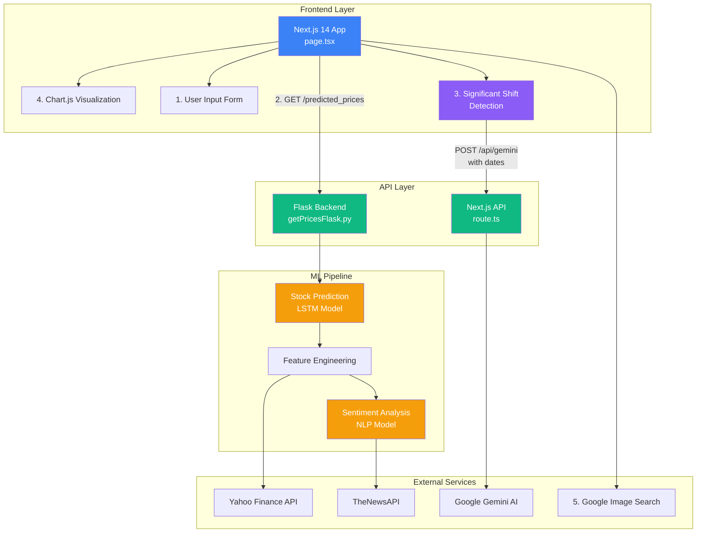

## USE FULLY DEPLOYED APP --> https://stock-see.vercel.app/ 

Hackathon Project Link: https://devpost.com/software/stocksee 

## WHAT IS STOCKSEE

Correlating real-world events with stock prices
- To foster an understanding of the stock price curve and showcase that it doesn't just randomly move but is actually based on real life and the real world (industry trends, the socioeconomic state, company earnings reports, product releases)

## WHAT IT DOES

Users are guided to a search bar where they can search a company stock for example "AAPL" and almost instantly they can see the stock price over the last two years as a graph, with green and red dots spread out on the line graph. When they hover over the dots, the green dots explain why there is a general increasing trend in the stock and a news article to back it up, along with the price change from the previous day and what it is predicted to be from. An image shows up on the side of the graph showing the company image as well.

## ABOUT THE PREDICTION MODEL

The yellow dots on the graph above represent predictions for the next 50 days of stock prices (into the future), made using a TensorFlow LSTM machine learning model. Each prediction is based on a batch of 200 previous daily stock prices, and the model forecasts the prices for the upcoming 50 days. A total of 1500 days of historical data is utilized in the training and validation process for each stock. By repeatedly training the model on all 30 stocks in the DOW JONES, a more comprehensive model has been created, of which is used to predicted the entered stock.

The model takes as input both the stock's daily closing prices and sentiment scores derived from public news articles. These sentiment scores are generated through a custom natural language processing (NLP) model, developed using TensorFlow and trained on a Kaggle dataset. The NLP model analyzes news articles related to the company, gathered via a news API, to assign a sentiment score for each day. By including not only the historical stock prices but also external factors like public sentiment and company news, the model is better equipped to predict future stock prices. Simply relying on past prices is insufficient, as factors such as company performance, innovation, and public perception play a critical role, making sentiment analysis an essential input for the prediction model. Furthermore, by creating a comprehensive model trained on 30 stocks (the ones in the DOW JONES), the prediction model used becomes even more accurate.

Note: The loss/accuracy curves below will stay constant in repeated entries since the pre-trained (on the 30 DOW JONES stocks) model is being loaded in. By going in LOCAL, one can then further train the prediction model and/or sentiment analysis ML models. It can also be set so that every new stock ticker entry further trains and improves the prediction model, though this is not a feature in the deployed version due to RAM constraints.

Can also view GRAPHS showcasing the ML model's performance metrics (loss, accuracy, etc...)

## IMAGES

## USING LOCALLY

When going deployed to local version, change...
  - (change url variable) page.tsx api request to the local backend not deployed backend url
  - can change training setting in stockPredictionsWithSentiment (switch between training on just entered companies historical date, further training ML model with entered company for continuous ML prediction model improvemnt, or just using the pre-trained model)
  - can also retrain the sentiment ML model if needed by calling the allocated sentimentML.py function

To run
- use "npm i" if needed then "npm run dev" in the overall directory (start frontend)
- within the "scripts" folder run "python getPricesFlask.py" (start backend)
- the application can now be used locally!
